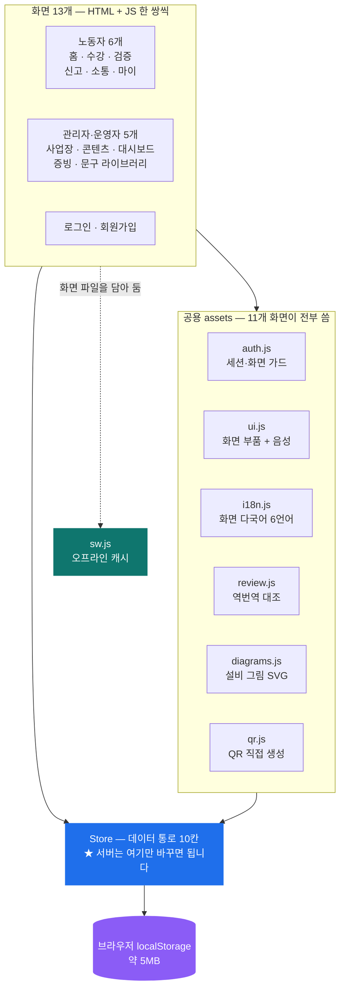
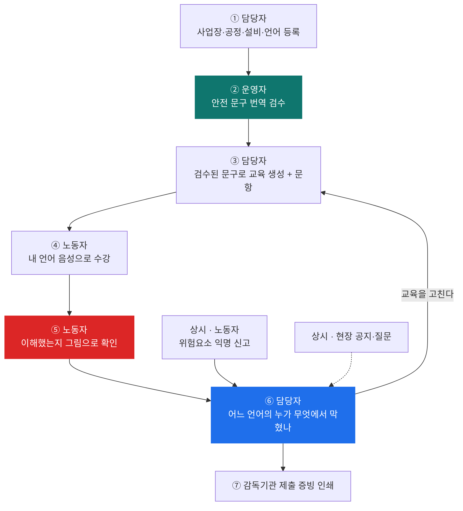
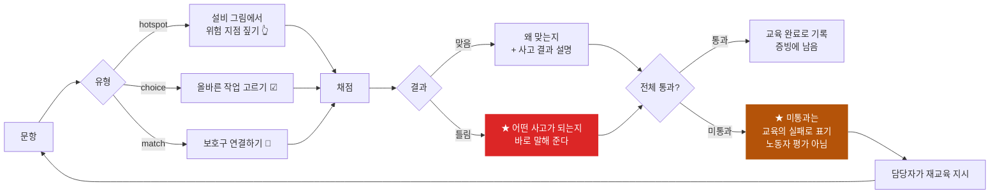
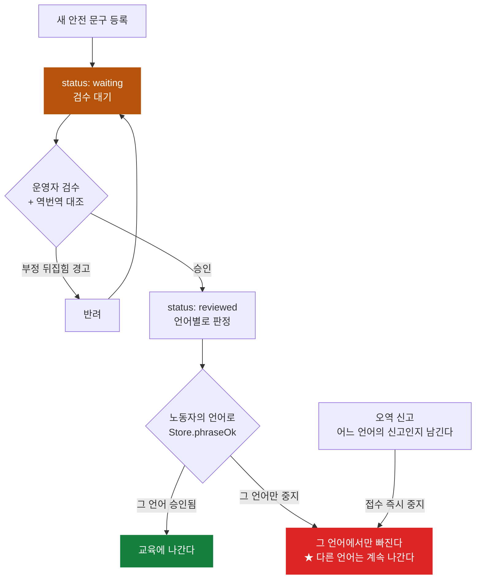
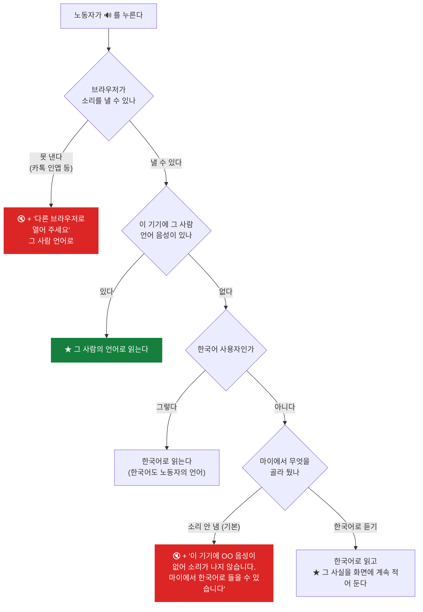
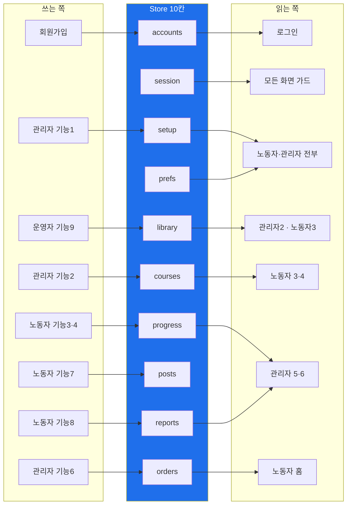
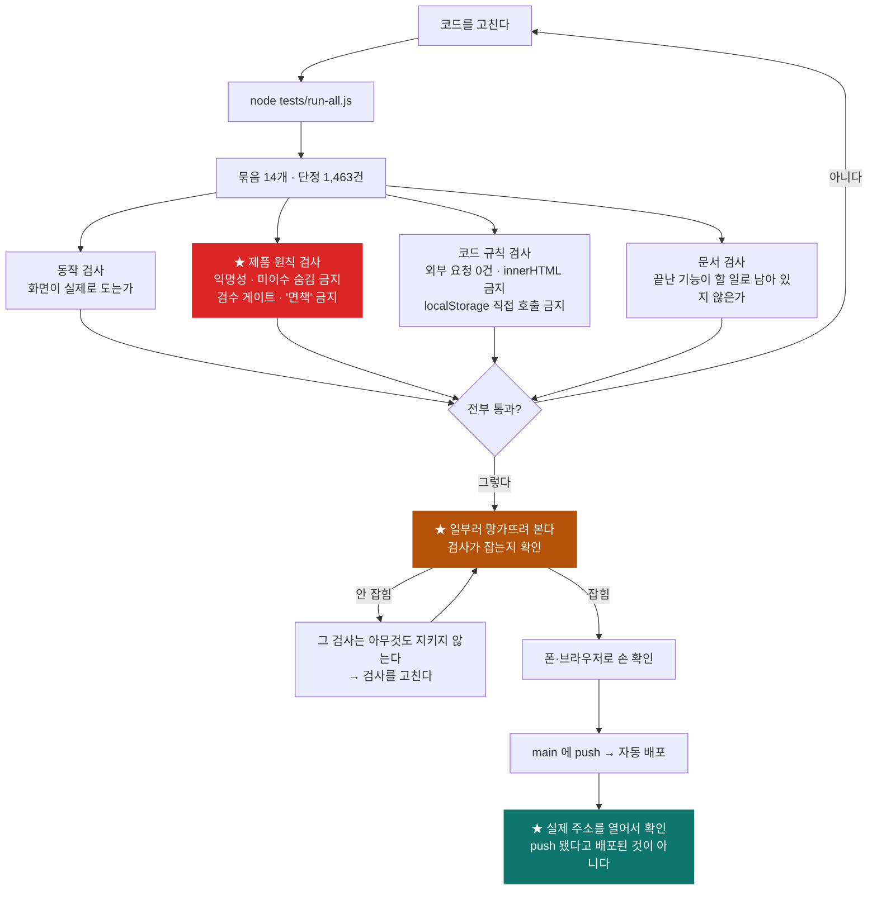

# 02. 아키텍처와 플로우차트

**그림 7장. 슬라이드에 그대로 옮겨 쓸 수 있게 만들었습니다.**

> **왜 mermaid 로 적었나** — GitHub 에서 바로 그림으로 보이고, 필요하면
> 캡쳐해서 슬라이드에 붙이면 됩니다. 기존 문서의 도해는 전부 ASCII 라
> 슬라이드에 붙이면 깨져 보입니다.
>
> **★ 발표에서 아키텍처를 오래 설명하지 마세요.** 심사위원이 보고 싶은 것은
> 구조의 아름다움이 아니라 **"이 팀이 자기가 만든 걸 아는가"** 입니다.
> 그림 1·2 만 쓰고 나머지는 질문받을 때 꺼내는 것을 권합니다.

---

## 그림 1. 시스템 구조 — 3층

**발표용 1순위.** 이 한 장으로 "빌드 없는 정적 웹" 과 "서버 붙일 자리" 가 동시에 설명됩니다.

> **말할 것** — *"화면 11개가 데이터를 직접 만지지 않습니다.
> 전부 `Store` 한 곳을 지나갑니다. 그래서 서버를 붙일 때
> **화면은 한 줄도 안 고칩니다.** 지금 저 파란 상자 안쪽만 바꾸면 됩니다."*

---

## 그림 2. 전체 흐름 — 개선 루프가 도는 것이 핵심

**발표용 2순위.** ⑤가 제품의 심장이고, **⑥ → ③ 으로 돌아오는 화살표**가 차별점입니다.

> **말할 것** — *"②에서 검수를 지나지 않은 문구는 어느 화면에도 안 나옵니다.
> ⑤가 저희가 만든 것이고, **⑥에서 ③으로 돌아가는 화살표가 다른 서비스에 없는 것**입니다.
> 남들은 ④에서 끝납니다."*

---

## 그림 3. 이해도 검증 — 글자 없이 판정하는 길

> **말할 것** — *"세 유형 전부 손가락으로만 합니다. **문항이 글로 돌아가는 순간
> 이건 기존 필기시험**이 되기 때문입니다. 그리고 틀렸을 때 정답만 알려 주지 않고
> **그 선택이 어떤 사고가 되는지**를 말해 줍니다. 안 그러면 다음에 또 같은 선택을 합니다."*

---

## 그림 4. 안전 문구가 노동자에게 닿기까지 — 검수 게이트

**"검수되지 않은 번역은 안전 지시로 쓰지 않는다"** 가 구조로 어떻게 지켜지는지.

> **말할 것** — *"크메르어 번역만 뜻이 뒤집혔으면 **크메르어만 내립니다.**
> 문구 전체를 내리면 인도네시아어 노동자도 그 안전 지시를 못 듣게 되는데,
> 그건 오역보다 나은 상태가 아닙니다."*

---

## 그림 5. 음성 판정 — 조용히 실패하지 않게

**가장 최근에 만든 것이고, 깊이를 보여주기 좋습니다.** 질문받으면 꺼내세요.

> **말할 것** — *"음성이 없을 때 한국어로 대신 읽어 주던 것을 **일부러 그만뒀습니다.**
> 크메르어 노동자에게 한국어 소리는 뜻이 닿지 않는데, **소리는 나는데 아무것도
> 전달되지 않으면 사람은 '들었다'고 생각하고 그대로 검증을 통과합니다.**
> 저희가 막으려는 상황이 정확히 그겁니다.
> 그래서 기본은 소리를 안 내고, **왜 안 내는지를 그 사람의 언어로 화면에 적습니다.**"*

---

## 그림 6. 데이터 10칸 — 누가 쓰고 누가 읽나

> **★ 증빙(기능5)이 이 그림에 "쓰는 쪽"으로 안 나오는 것을 눈여겨보세요.**
> 증빙 화면에는 **저장하는 코드가 아예 없습니다.**
> "수정 불가"를 규칙이 아니라 **구조**로 만든 것입니다.

---

## 그림 7. 검증 파이프라인 — 무엇이 무엇을 지키나

> **말할 것** — *"검사가 동작만 보지 않습니다. **제품 원칙이 코드에 남아 있는지**도 봅니다.
> 신고에 신고자를 식별할 값이 들어오면 검사가 깨집니다.
> 증빙에 '면책'이라는 단어가 들어오면 검사가 깨집니다.
> 그리고 **검사를 믿지 않으려고 일부러 망가뜨려 봅니다.** 안 잡히면 그 검사는
> 아무것도 지키지 않는 것이니까요."*

---

## 함께 볼 것

- [`03-검증-신뢰도와-숫자.md`](03-검증-신뢰도와-숫자.md) — 그림 7의 숫자와 **검사가 못 하는 것**
- [`../08-overview.md`](../08-overview.md) 4부·5부 — 파일 구조와 데이터 10칸 상세
- [`../09-handover.md`](../09-handover.md) — 데이터 계약과 함정 모음
