# 06. 한계 · 결핍 · 개선 로드맵

> **이 프로젝트의 방식은 "먼저 말하기" 입니다.**
> 심사위원은 단정하는 팀을 한 번 더 찔러 봅니다.
> **약점을 먼저 말하면 그 질문이 사라지고, 태도가 점수가 됩니다.**

---

## 1. ★ 발표에서 먼저 말할 것 — 3개만

전부 말하면 발표가 사과문이 됩니다. **아래 셋만** 고르세요.

| 무엇 | 어떻게 말할까 |
|---|---|
| **실제 이주노동자에게 안 보여 줬습니다** | *"저희가 가장 못 한 부분입니다. **만든 사람은 어디를 눌러야 할지 이미 알아서** 스스로 확인이 안 됩니다. 다음에 할 일 1번이 이겁니다."* |
| **서버가 없습니다** | *"의도한 범위입니다. **검증 방식을 먼저 증명하는 것**이 이번 목표였고, 서버를 붙일 자리는 `Store` 한 곳으로 좁혀 뒀습니다."* |
| **제품 안 AI 번역이 아직 안 돕니다** | *"순서를 그렇게 잡았습니다. **번역을 자동화하기 전에 검수 게이트를 먼저 만들었습니다.** 검수 없는 자동 번역은 오역이 그대로 안전 지시가 됩니다."* |

> ### 이 셋의 공통점
> **셋 다 "못 했다" 가 아니라 "이 순서로 했다" 로 말할 수 있습니다.**
> 그게 변명과 설계의 차이입니다.

---

## 2. 한계 전체 — 종류별

### 2.1 실증하지 못한 것 (가장 아픈 곳)

| 무엇 | 왜 못 했나 | 메우는 법 |
|---|---|---|
| **실제 이주노동자 사용** | 사람에게 보여 주는 일정을 계획에 안 넣었습니다 | 한 사람에게라도 건네 보기. **아무 설명 없이** |
| **"글자 한 자 안 읽고 끝까지"** | 만든 사람은 이미 답을 압니다 | 남에게 폰을 건네고 **아무 말도 안 하기** |
| **QR 폰 카메라 촬영** | 되읽기 검사는 "내 글씨를 내가 읽는 것" 이라 규격 오해를 못 잡습니다 | 촬영 전에 실제로 찍어 보기 |
| **iOS** | 안드로이드 기준으로 만들었습니다 | 아이폰 하나로 5분 |
| **크메르어 음성 없는 실기기** | 검사는 가짜 음성 목록으로 흉내 냈습니다 | 네팔어·타이어로 바꿔 보면 대신 확인됩니다 |

### 2.2 기능이 없는 것

| 무엇 | 지금 | 크기 |
|---|---|---|
| **댓글 수정·삭제** | 글은 되고 댓글은 안 됩니다 | 작음 |
| **기한 알림** | 담당자가 대시보드를 열어야 압니다. 노동자에게는 기한이 안 보입니다 | 중간 (저장할 자리가 필요) |
| **설명 문단·정책 문장 번역** | 동선(버튼·탭·배지·음성)은 6개 언어인데 **긴 설명 문단은 한국어**입니다 | 중간 |
| **다중 사업장** | 사업장 1개 전제입니다 | 중간 |
| **증빙 쪽 번호** | 없습니다 | 작음 |

### 2.3 구조상 지금 못 하는 것 (서버가 필요)

| 무엇 | 왜 |
|---|---|
| **현장 실사진 hotspot** | `localStorage` 약 5MB. **사진이 필요해지는 시점이 서버가 필요해지는 시점**입니다 |
| **실제 6개 언어 음성** | 브라우저 음성합성을 씁니다. 음성도 문구처럼 **검수 상태를 가져야** 합니다 |
| **문항 검수** | 문항 문구는 라이브러리 검수를 안 지납니다 (오답 선택지까지 안전 문구로 들어가는 문제 때문) |
| **익명 유지 회신** | 신고자를 식별하지 않는 티켓 번호로 *"조치됐습니다"* 를 보내려면 서버가 필요합니다 |
| **증빙 위조 검증** | 생성 시점 해시·타임스탬프 |
| **기기 간 데이터 공유** | 지금은 내보내기/불러오기로 JSON 을 옮깁니다 |
| **문항 난이도 자동 관측** | 최초 통과율이 70~85% 밖으로 나가면 경고 |

### 2.4 방법론의 한계 (정직하게 말할 값이 있는 것)

| 무엇 | 왜 문제인가 |
|---|---|
| **번역과 역번역을 같은 사람이 넣습니다** | 번역기를 두 번 돌려 붙이면 대조가 통과합니다. **진짜 대조는 두 사람이 나눠야** 뜻이 있는데, 그건 사람 절차라 화면으로 못 막습니다 |
| **화면 다국어 사전은 검수를 안 지납니다** | 그래서 **사전에 안전 지시가 못 들어오게** 검사로 막았습니다. 안전 지시는 반드시 기능9 를 지나야 합니다 |
| **검사는 "사람이 이해했다" 를 증명하지 못합니다** | [`03`](03-검증-신뢰도와-숫자.md) §5 |

---

## 3. 개선 로드맵 — 순서에 이유가 있습니다

```mermaid
flowchart LR
    subgraph P0["지금 (서버 없이 · 며칠)"]
        A1["실제 사람에게 건네 보기"]
        A2["QR 폰 촬영 · iOS 확인"]
        A3["댓글 수정·삭제"]
        A4["설명 문단 번역"]
    end
    subgraph P1["서버 붙이기 (Store 한 곳)"]
        B1["기기 간 데이터 공유"]
        B2["기한 알림"]
        B3["다중 사업장"]
    end
    subgraph P2["서버가 있어야 되는 것"]
        C1["현장 실사진 hotspot"]
        C2["검수된 6개 언어 음성"]
        C3["문항 검수 파이프라인"]
        C4["익명 유지 회신 채널"]
        C5["증빙 위조 검증"]
    end
    subgraph P3["쌓이면 생기는 것 = 방어력"]
        D1["검수 문구 200개 x 6언어"]
        D2["언어별 오답 데이터"]
        D3["문항 난이도 자동 관측"]
    end

    P0 --> P1 --> P2 --> P3
    style P0 fill:#15803d,color:#fff
    style P3 fill:#1f6feb,color:#fff
```

> **말할 것** — *"순서를 이렇게 잡은 이유는, **서버를 붙이는 것이 가장 쉽고
> 사람에게 보여 주는 것이 가장 어렵기** 때문입니다. 어려운 것을 먼저 하려고 합니다."*
>
> **그리고 오른쪽 파란 상자가 이 제품의 방어력입니다** — 화면은 따라 만들 수 있지만
> **검수된 번역과 언어별 오답 데이터는 시간과 돈이 쌓여야** 생깁니다.

---

## 4. "다음에 무엇을 하겠습니까" 라고 물으면

**한 개만 답하세요. 세 개 답하면 아무것도 안 정한 것으로 들립니다.**

> *"실제 이주노동자 한 분에게 **아무 설명 없이 폰을 건네는 것**입니다.
> 저희가 만든 주장이 **'글자를 한 자도 안 읽고 끝까지 갈 수 있다'** 인데,
> 그건 코드로 증명할 수 없습니다. 그 한 번이 검사 1,463건보다 많은 것을 알려 줄 겁니다."*

---

## 함께 볼 것

- [`03-검증-신뢰도와-숫자.md`](03-검증-신뢰도와-숫자.md) §5 — 검사가 증명 못 하는 것
- [`05-PPT-프로그램-대조표.md`](05-PPT-프로그램-대조표.md) §2 — 쓰면 거짓말이 되는 표현
- [`08-발표당일-개발질문-답변.md`](08-발표당일-개발질문-답변.md) — 찔렸을 때
- [`../07-next-tasks.md`](../07-next-tasks.md) — 개발 쪽 원본 목록
