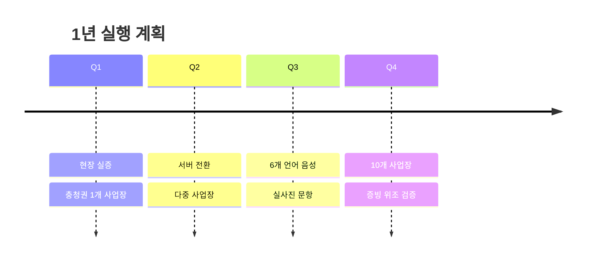

# 10. 정량 지표와 실행 계획 — 숫자로 답하는 칸

> **받은 피드백** — *"구현 결과를 너무 짧게 썼다. 정량 지표화로 보여줘라"* ·
> *"기대효과에 숫자 안 들어간 게 너무 아쉽다. 넣어라"* ·
> *"실행 계획을 D+30 말고 1년 4분기로"* · *"깃 커밋이나 열심히 작업한 게 많다는 것을 강조"*
>
> **이 문서의 숫자는 전부 저장소에서 계산한 것입니다.** 추정한 것은 §4 하나이고,
> 거기는 **가정을 표에 적어 뒀습니다.**

---

## 1. 개발 충실도 — 저장소에서 계산한 숫자

### 커밋

| 무엇 | 숫자 |
|---|---:|
| 전체 커밋 | **86개** |
| ├ `feat:` 새 기능 | **33개** |
| ├ `docs:` 문서 | **28개** |
| ├ `merge:` 병합 | **8개** |
| ├ `fix:` 버그 수정 | **3개** |
| └ `chore:` 그 외 | **2개** |
| 코드 증감 | **+41,338 / −3,296줄** |
| 작업일 | **8일** (2026-08-19 ~ 08-30, 12일 중) |

### ★ 이 표에서 말할 것 두 가지

**① `feat:` 33 대 `docs:` 28 — 거의 1 대 1 입니다.**

> *"기능 하나를 만들 때마다 문서 하나를 남겼습니다.
> 기록이 개발의 부산물이 아니라 **개발 절차의 일부**였습니다."*

**② `fix:` 가 3개뿐입니다.**

이건 *"버그가 없었다"* 가 아닙니다. **커밋 전에 잡혔다**는 뜻입니다.

> *"버그 수정 커밋이 3개인 이유는 잘 만들어서가 아닙니다.
> **검사가 커밋 전에 잡았기 때문입니다.**
> 실제로 잡힌 결함은 개발일지에 9건을 이름 붙여 적어 뒀습니다."*

### 날짜별 커밋 — 실제 작업 리듬

| 날짜 | 커밋 | 그날 한 것 |
|---|---:|---|
| 08-19 | **12** | 문항 3유형 · 화면 골격 |
| 08-21 | **24** | 문항 다국어 · 언어별 검수 판정 (개인 개발 전환) |
| 08-24 | 4 | 교육 기한 |
| 08-25 | **12** | Vercel 배포 · 폰 실기 · 음성 실패 감지 |
| 08-26 | 10 | 문구 추가 · 기간 필터 · 내 글 수정 |
| 08-27 | 6 | 글자 크기 · 목업 대조 · 재교육 지시 |
| 08-28 | **17** | 오프라인 · QR · 화면 다국어 · 음성 신고 |
| 08-30 | 3 | 음성 되돌림 · 발표 인계 |

> **슬라이드에 넣을 때** — 이 표를 **막대 그래프**로 그리면 "8일 동안 꾸준히" 가
> 한눈에 보입니다. 숫자만 있는 표보다 훨씬 낫습니다 (피드백: *"표에 글만 있으면 난독증"*).

---

## 2. 구현 완료 — 정량화

### 계획 대비 완료율

| | 항목 수 | 완료 | 비율 |
|---|---:|---:|---:|
| 계획한 개발 항목 | **23** | **23** | **100%** |
| 계획 밖 추가 항목 | **3** | **3** | — |
| **합계** | **26** | **26** | **100%** |

**23개 항목의 정체** (`docs/07-next-tasks.md` 의 `- [x]`)

| 묶음 | 항목 | 개수 |
|---|---|---:|
| A. 데이터 모양 | 문항 다국어 · 언어별 검수 판정 | 2 |
| B. 기반 | 교육 기한 · 문구 추가 폼 · 글자 크기 · 목업 대조 · 화면 정리 | 5 |
| C. 화면 완성도 | 기간별 증빙 · 기간 필터 · 내 글 수정 · 문항 복기 · 문구 넘겨보기 · 문항 수정 · 관리자 답글 · 내 언어 바꾸기 | 8 |
| D. 마무리 | QR 이미지 · 재교육 지시 · PC/모바일 레이아웃 | 3 |
| V. 배포 | 예시 자동 채우기 · Vercel 배포 · 폰 확인 · 음성 실패 감지 | 4 |
| E. 오프라인 | Service Worker | 1 |
| **번호 밖** | 화면 다국어 · 음성 신고 · 음성 되돌림 | 3 |

### 기능별 구현 수준

| # | 기능 | 화면 | 상태 |
|---:|---|---|---|
| 1 | 사업장·설비 등록 | `admin/setup` | **완료** |
| 2 | 교육 콘텐츠 생성 | `admin/content` | **완료** (문항 번역 · 기한 · QR · 발급 후 수정) |
| 3 | 안전교육 수강 | `worker/learn` | **완료** |
| 4 | **이해도 검증** ★ | `worker/quiz` | **완료** (3유형 · 문항 기록) |
| 5 | 교육 증빙 | `admin/proof` | **완료** (기간별 묶음) |
| 6 | 담당자 대시보드 | `admin/dashboard` | **완료** (기간 필터 · 재교육 지시) |
| 7 | 현장 즉시 소통 | `worker/talk` | **완료** (수정·삭제 · 공식 답변) |
| 8 | 위험요소 신고 | `worker/report` | **완료** (**음성 신고**) |
| 9 | 안전 문구 라이브러리 | `admin/library` | **완료** (언어별 판정 · 추가 폼) |
| — | 홈 · 마이 · 로그인 · 회원가입 | | **완료** |

**화면 11개 = 계획 11개. 미구현 화면 0개.**

### 코드 규모

| 무엇 | 숫자 |
|---|---:|
| 제품 코드 | **16,139줄** (파일 40개) |
| 검사 코드 | **6,288줄** (묶음 14개) |
| **검사 / 제품 비율** | **0.39** |
| 자동 검사 단정 | **1,463건** |
| 외부 의존성 | **0개** |

> **말할 것** — *"제품 코드 10줄당 검사 코드 4줄을 썼습니다."*

---

## 3. ★★ 우리 소프트웨어가 실제로 만들어내는 숫자

**피드백 중 *"실제 데이터를 만져서"* 에 가장 정확히 답하는 칸입니다.**
남의 통계가 아니라 **우리 프로그램이 계산한 숫자**입니다.

### 화면이 직접 출력하는 값 (담당자 대시보드)

`kim@daesung.co.kr` 로 로그인하면 이 숫자가 그대로 떠 있습니다.

| 타일 | 값 |
|---|---:|
| 이수 | **1건** |
| 미통과 | **1건** |
| 미수강 | 0건 |
| **최초 통과율** | **50%** |
| 화면이 덧붙이는 말 | **"목표 70~85% 보다 낮습니다"** |

### 여기서 나오는 대조 — 이게 발표의 핵심 숫자입니다

두 사람이 교육을 받고 검증까지 갔습니다. **같은 사업장, 같은 교육, 같은 두 사람인데
무엇으로 세느냐에 따라 숫자가 이렇게 갈립니다.**

| 무엇으로 세나 | 결과 |
|---|---:|
| **수강 기록으로** (= 지금의 서명부 방식) | 2명 중 2명 → **100%** |
| **이해했는지로** (= 저희가 만든 것) | 2명 중 1명 → **50%** |

> *"지금 모든 사업장이 보고 있는 숫자는 위쪽입니다.
> 저희가 만든 것은 **아래쪽을 만드는 장치**입니다."*

**슬라이드에는 100% 와 50% 를 나란히 큰 글씨로** 놓는 것을 권합니다.
문제 정의와 해결이 이 한 장에서 닫힙니다.

> ### ★ 한 겹 더 — 화면이 스스로 "고쳐야 한다" 고 말합니다
> 통과율 50% 옆에 **"목표 70~85% 보다 낮습니다"** 가 자동으로 붙습니다.
> *"이 제품은 점수를 매기고 끝내지 않습니다. **이 숫자가 낮으면 노동자가 아니라
> 교육을 고쳐야 한다**고 화면이 말합니다."* — 개선 루프가 화면에 드러나는 지점입니다.

> **정직하게 붙일 말** — *"100% 는 수강 기록으로 계산한 것이고,
> 50% 는 화면이 직접 출력하는 값입니다. 둘 다 예시 데이터 기준입니다.
> 실제 사업장에 넣으면 실측으로 바뀝니다.
> 저희가 파는 것은 특정 숫자가 아니라 **이 숫자를 만드는 장치**입니다."*

> **정직하게 붙일 말** — *"예시 데이터 기준입니다.
> 실제 사업장에 넣으면 이 숫자가 실측으로 바뀝니다.
> 저희가 파는 것은 특정 숫자가 아니라 **이 숫자를 만드는 장치**입니다."*

그리고 우리가 설계에 넣은 기준이 하나 더 있습니다.

> **문항 최초 통과율 목표 = 70~85%.**
> 이 밖으로 나가면 문항이 너무 쉽거나 너무 어렵다는 뜻이고,
> **문항을 고쳐야 한다는 신호**입니다 (E층의 "문항 난이도 자동 관측").

---

## 4. 기대효과 추정 — 가정을 드러내고 범위로 말합니다

> **★★ 여기가 위험한 칸입니다.** 단일 숫자를 지어내면 그것 하나가 틀렸을 때
> **검사 1,463건까지 같이 의심받습니다.** 그래서 **가정을 표에 적고 범위로** 냅니다.

### 계산 틀

```
전국 외국인 산재 피해자 (2024년) = 9,219명   ← 출처 있음 (고용노동부·근로복지공단)
        × 언어·이해 부족이 관여한 비율  = A%   ← ★ 조사해서 채울 칸
        × 이해도 검증으로 예방 가능한 비율 = B% ← ★ 근거 필요
        = 연간 예방 가능 재해 건수
```

### 감응도 표 — "A 가 이 값이면 B 는 이 값" 으로 보여 주기

| A (언어·이해 관여) | B = 20% | B = 30% | B = 40% |
|---:|---:|---:|---:|
| **10%** | 184명 | 277명 | 369명 |
| **20%** | 369명 | 553명 | 738명 |
| **30%** | 553명 | 830명 | 1,106명 |

> **이렇게 쓰는 법** — *"언어·이해 요인이 20%만 관여하고, 그중 30%만 막을 수 있다고
> 보수적으로 잡아도 **연간 550명 규모**입니다."*
>
> **한 칸을 골라 말하고, 표 전체를 슬라이드에 함께 보여 주세요.**
> 단일 숫자를 던지면 *"그 20%는 어디서 나왔죠?"* 로 무너집니다.
> **표를 보여 주면 "가정을 밝히고 계산했다" 가 됩니다.**

### ★ A · B 를 채우려면 조사해야 합니다 (제가 확인하지 않았습니다)

| 채울 값 | 어디서 찾나 |
|---|---|
| **A** — 외국인 재해 중 언어·소통·교육 요인 비율 | 한국보건사회연구원 *「이주노동자 산업안전보건 현황과 정책 과제」* (출처 목록 7번). 여기 있을 가능성이 높습니다 |
| **B** — 안전교육 개선의 재해 감소 효과 | 안전보건공단 교육 효과성 연구 · 국제 문헌(OSHA 등) |
| 대안 | 둘 다 못 찾으면 **A·B 를 "가정" 이라고 못 박고 표만** 보여 주기. 그것도 충분합니다 |

### 비용 쪽 효과는 비워 둡니다

과태료 · 산재보험료 · 생산성 손실 금액은 **확인하지 못해서 넣지 않았습니다.**
이유와 확인할 곳은 [`01-왜-사업자가-이걸-쓰는가.md`](01-왜-사업자가-이걸-쓰는가.md) §4 에 있습니다.

---

## 5. 실행 계획 — 4분기로 (피드백 반영)

**피드백** — *"D+30 같은 표기는 안 와닿는다. 1년을 4분기로"* ·
*"표에 자세히 쓰지 말고 '핵심기능 2개 구현 및 배포' 처럼 간단하게"*

| 분기 | 한 줄 | 끝나면 무엇이 생기나 |
|---|---|---|
| **Q1** | **현장 실증 + 충청권 1개 사업장 도입** | 실제 노동자가 쓴 데이터. "글자 없이 끝까지" 실증 |
| **Q2** | **서버 전환 + 다중 사업장** | 기기 간 데이터 공유 · 기한 알림 · 사업장 여러 곳 |
| **Q3** | **검수된 6개 언어 음성 + 실사진 문항** | 문구 200개 × 6언어. 실제 설비 사진으로 위험 지점 짚기 |
| **Q4** | **충청권 10개 사업장 + 증빙 위조 검증** | 언어별 오답 데이터가 쌓임 = 따라오기 어려워짐 |



> **★ 시각화 팁** — 각 분기에 **아이콘 하나 + 한 줄**만 넣고, 자세한 내용은
> 발표자가 말로 하세요. 표에 글이 빽빽하면 심사위원은 안 읽습니다.
>
> **그리고 Q1 이 "개발" 이 아니라 "실증" 인 것이 중요합니다.**
> 개발은 이미 됐고, **가장 어려운 것을 1분기에 놓았다**는 신호입니다.

---

## 6. 슬라이드 배치 제안

피드백 *"해결결과와 기대효과를 하나로 합쳐라"* 를 반영했습니다.

| 슬라이드 | 무엇 | 이 문서에서 |
|---|---|---|
| **구현 결과** | 완료율 100% (26/26) · 화면 11개 · 검사 1,463건 · 코드 규모 | §2 |
| **개발 충실도** | 커밋 86개 막대 그래프 · `feat` 33 : `docs` 28 · `fix` 3의 의미 | §1 |
| **★ 해결 결과 + 기대효과** (합침) | **100% vs 50%** 를 크게 + "목표보다 낮습니다" + 감응도 표 | §3 · §4 |
| **실행 계획** | Q1~Q4 아이콘 + 한 줄 | §5 |

---

## 함께 볼 것

- [`03-검증-신뢰도와-숫자.md`](03-검증-신뢰도와-숫자.md) — 검사 숫자 상세 · 정정표
- [`09-체계적으로-기록하며-개발했다.md`](09-체계적으로-기록하며-개발했다.md) — 충실도의 질적 증거
- [`01-왜-사업자가-이걸-쓰는가.md`](01-왜-사업자가-이걸-쓰는가.md) — 비용 쪽 논리 (금액은 비어 있음)
- [`06-한계와-개선-로드맵.md`](06-한계와-개선-로드맵.md) — Q1~Q4 의 근거가 된 로드맵
